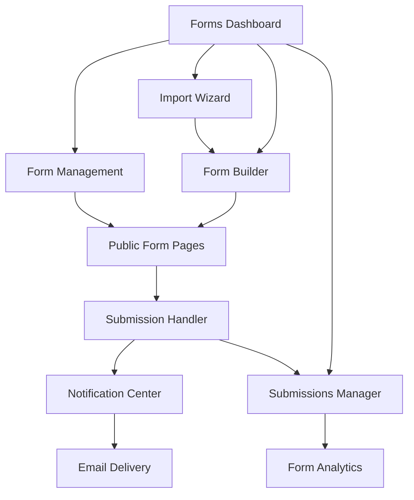

# SCYC Forms Administration System - Product Requirements Document

## 1. Product Overview

A comprehensive forms administration system for the South Caernarfonshire Yacht Club website that enables creation, management, and processing of various forms including contact forms, membership applications, and event registrations. The system provides seamless import capabilities for existing FluentForm data and offers a powerful admin interface for form management.

* **Primary Purpose**: Digitize and streamline all club form processes, replacing the existing WordPress FluentForm system with a modern, integrated solution.

* **Target Users**: Club administrators, members, and website visitors submitting various applications and inquiries.

* **Market Value**: Reduces administrative overhead, improves data management, and enhances user experience for club operations.

## 2. Core Features

### 2.1 User Roles

| Role    | Registration Method           | Core Permissions                                                                 |
| ------- | ----------------------------- | -------------------------------------------------------------------------------- |
| Admin   | Supabase Auth (admin role)    | Full form management, view all submissions, export data, configure notifications |
| Member  | Supabase Auth (authenticated) | Submit forms, view own submissions                                               |
| Visitor | Anonymous access              | Submit public forms (contact, inquiries)                                         |

### 2.2 Feature Module

Our forms administration system consists of the following main pages:

1. **Forms Dashboard**: Admin overview, form statistics, recent submissions, quick actions
2. **Form Builder**: Drag-and-drop form creation, field configuration, validation rules, styling options
3. **Form Management**: Form list, edit existing forms, duplicate forms, form settings
4. **Submissions Manager**: View all submissions, filter and search, export data, manage responses
5. **Import Wizard**: FluentForm data import, field mapping, data validation, migration tools
6. **Notification Center**: Email template management, notification rules, delivery status
7. **Form Analytics**: Submission statistics, conversion rates, performance metrics
8. **Public Form Pages**: Dynamic form rendering, submission handling, confirmation pages

### 2.3 Page Details

| Page Name           | Module Name          | Feature Description                                                                                        |
| ------------------- | -------------------- | ---------------------------------------------------------------------------------------------------------- |
| Forms Dashboard     | Overview Panel       | Display form statistics, recent submissions count, quick access to popular forms                           |
| Forms Dashboard     | Quick Actions        | Create new form, import data, view recent submissions, system alerts                                       |
| Form Builder        | Field Library        | Drag-and-drop interface with text inputs, email, textarea, select, checkbox, radio, file upload, reCAPTCHA |
| Form Builder        | Validation Engine    | Required fields, email validation, custom regex patterns, conditional logic                                |
| Form Builder        | Styling System       | Custom CSS editor, theme presets, responsive design controls                                               |
| Form Management     | Form List            | Paginated table with form names, status, submission count, last modified date                              |
| Form Management     | Form Actions         | Edit, duplicate, delete, preview, publish/unpublish forms                                                  |
| Form Management     | Settings Panel       | Form metadata, notification settings, redirect URLs, access permissions                                    |
| Submissions Manager | Data Grid            | Sortable table with submission data, timestamps, form source, status indicators                            |
| Submissions Manager | Export Tools         | CSV/Excel export, date range filtering, field selection, bulk operations                                   |
| Submissions Manager | Response Actions     | Mark as read/unread, add notes, delete submissions, send replies                                           |
| Import Wizard       | Data Parser          | Parse FluentForm JSON, validate field mappings, preview import data                                        |
| Import Wizard       | Migration Tools      | Map old fields to new structure, handle custom fields, preserve metadata                                   |
| Import Wizard       | Validation System    | Check data integrity, identify conflicts, generate import reports                                          |
| Notification Center | Email Templates      | WYSIWYG editor, variable insertion, template library, preview functionality                                |
| Notification Center | Delivery Rules       | Conditional notifications, multiple recipients, scheduling options                                         |
| Form Analytics      | Statistics Dashboard | Submission trends, form performance, conversion rates, popular fields                                      |
| Form Analytics      | Reporting Tools      | Generate reports, export analytics, date range selection, comparative analysis                             |
| Public Form Pages   | Form Renderer        | Dynamic form display, responsive layout, progressive enhancement                                           |
| Public Form Pages   | Submission Handler   | Form validation, data processing, confirmation messages, error handling                                    |

## 3. Core Process

### Admin Flow

1. Admin logs into dashboard and views form statistics
2. Creates new forms using drag-and-drop builder or imports existing FluentForm data
3. Configures form settings, validation rules, and notification preferences
4. Publishes forms and embeds them on website pages
5. Monitors submissions through the management interface
6. Exports data and generates reports as needed

### User Submission Flow

1. Visitor accesses form on website (contact, membership, etc.)
2. Fills out form fields with client-side validation
3. Submits form with server-side validation and processing
4. Receives confirmation message and optional email receipt
5. Admin receives notification email with submission details

### Import Process Flow

1. Admin accesses Import Wizard from dashboard
2. Uploads FluentForm JSON export file
3. System parses and validates form structure
4. Admin maps old fields to new form builder fields
5. Reviews import preview and confirms migration
6. System creates new forms and imports historical data

## 4. User Interface Design

### 4.1 Design Style

* **Primary Colors**: Navy blue (#1e3a8a) for headers and primary actions, Gold (#d4af37) for accents and highlights

* **Secondary Colors**: Light gray (#f8fafc) for backgrounds, Dark gray (#374151) for text

* **Button Style**: Rounded corners (8px), solid fills for primary actions, outlined for secondary actions

* **Typography**: Inter font family, 16px base size, 14px for form labels, 12px for helper text

* **Layout Style**: Card-based design with subtle shadows, clean grid layouts, responsive breakpoints

* **Icons**: Heroicons outline style, consistent 20px size, navy blue color scheme

### 4.2 Page Design Overview

| Page Name           | Module Name      | UI Elements                                                                                         |
| ------------------- | ---------------- | --------------------------------------------------------------------------------------------------- |
| Forms Dashboard     | Overview Panel   | Grid layout with metric cards, navy blue headers, gold accent numbers, responsive 2-4 column layout |
| Forms Dashboard     | Quick Actions    | Horizontal button group, primary navy buttons, hover effects, icon + text labels                    |
| Form Builder        | Field Library    | Sidebar with draggable field components, categorized sections, search functionality                 |
| Form Builder        | Canvas Area      | Drop zones with visual feedback, field preview, inline editing, responsive preview modes            |
| Form Builder        | Properties Panel | Collapsible sections, form inputs with labels, validation indicators, save/cancel actions           |
| Form Management     | Form List        | Data table with alternating row colors, action buttons, status badges, pagination controls          |
| Submissions Manager | Data Grid        | Sortable columns, row selection, bulk action toolbar, export button, search/filter bar              |
| Import Wizard       | Step Indicator   | Progress breadcrumb, current step highlighting, navigation controls                                 |
| Import Wizard       | Upload Area      | Drag-and-drop zone, file type validation, progress indicators, error messages                       |
| Notification Center | Template Editor  | Split-pane layout, code editor with syntax highlighting, live preview panel                         |
| Public Form Pages   | Form Container   | Clean white background, proper spacing, mobile-first responsive design                              |
| Public Form Pages   | Form Fields      | Consistent styling matching site theme, focus states, validation messages                           |

### 4.3 Responsiveness

The forms administration system is designed mobile-first with responsive breakpoints at 640px, 768px, 1024px, and 1280px. Touch interactions are optimized for mobile devices, with larger tap targets and swipe gestures for navigation. The form builder adapts to smaller screens with collapsible panels and simplified interfaces.

## 5. Technical Integration

### 5.1 Database Schema Requirements

**Forms Table**

* id, title, description, fields\_config (JSON), settings (JSON), status, created\_at, updated\_at

**Form Submissions Table**

* id, form\_id, submission\_data (JSON), ip\_address, user\_agent, status, created\_at

**Form Templates Table**

* id, name, description, template\_config (JSON), category, is\_public

**Notification Rules Table**

* id, form\_id, trigger\_conditions (JSON), recipients, template\_id, is\_active

### 5.2 Import Data Structure

The system must handle FluentForm JSON structure including:

* Form fields with validation rules and conditional logic

* Custom CSS styling and JavaScript enhancements

* Notification settings and email templates

* Form metadata and configuration options

### 5.3 API Endpoints

* `GET/POST /api/forms` - Form CRUD operations

* `GET/POST /api/submissions` - Submission management

* `POST /api/forms/import` - FluentForm data import

* `GET /api/forms/{id}/export` - Data export functionality

* `POST /api/notifications/send` - Manual notification triggers

## 6. Security & Compliance

### 6.1 Data Protection

* All form submissions encrypted at rest

* GDPR compliance with data retention policies

* User consent tracking and management

* Secure file upload with virus scanning

### 6.2 Access Control

* Role-based permissions for form management

* Rate limiting on form submissions

* CSRF protection on all form endpoints

* Input sanitization and validation

### 6.3 Privacy Features

* Anonymous submission options

* Data anonymization tools

* Automatic data purging schedules

* Audit logging for admin actions

