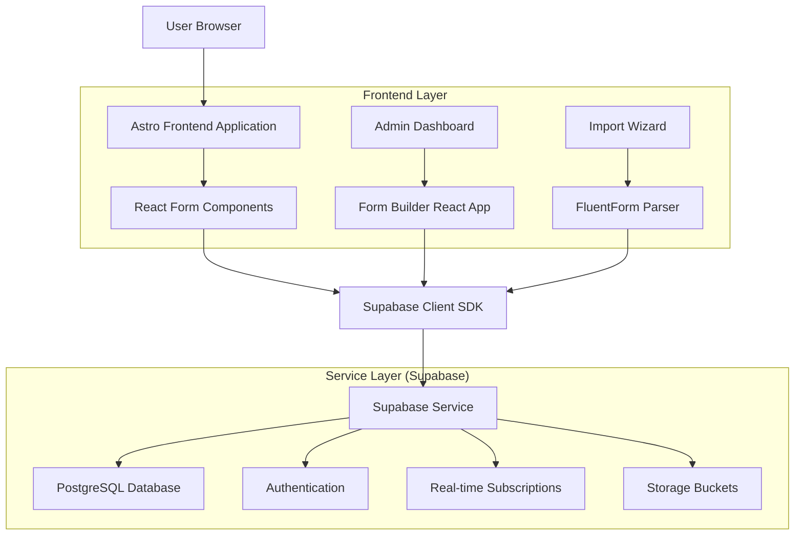
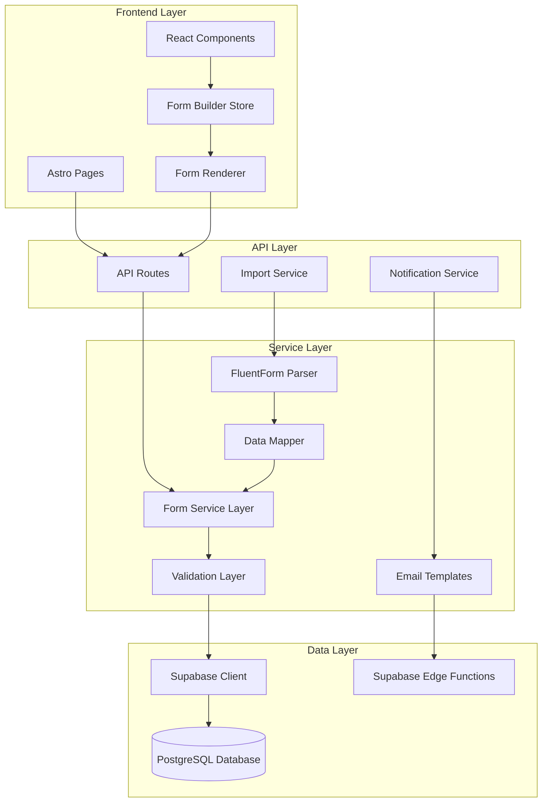
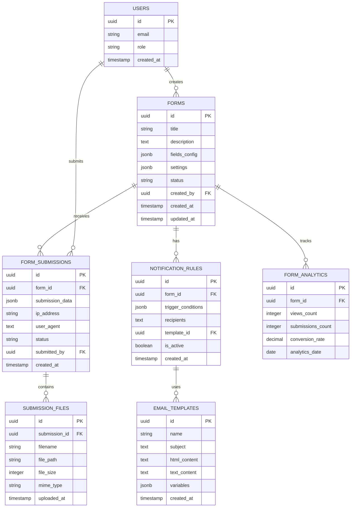

# SCYC Forms Administration System - Technical Architecture Document

## 1. Architecture Design



## 2. Technology Description

* **Frontend**: Astro\@4 + React\@18 + TypeScript + TailwindCSS + Vite

* **Backend**: Supabase (PostgreSQL + Auth + Real-time + Storage)

* **Form Builder**: React DnD + Formik + Yup validation

* **Email Service**: Supabase Edge Functions + Resend/SendGrid

* **File Storage**: Supabase Storage for form attachments

* **State Management**: Zustand for form builder state

## 3. Route Definitions

| Route                      | Purpose                              |
| -------------------------- | ------------------------------------ |
| /admin/forms               | Forms administration dashboard       |
| /admin/forms/builder       | Drag-and-drop form builder interface |
| /admin/forms/builder/\[id] | Edit existing form                   |
| /admin/forms/submissions   | View and manage form submissions     |
| /admin/forms/import        | FluentForm data import wizard        |
| /admin/forms/analytics     | Form performance and analytics       |
| /admin/forms/notifications | Email notification management        |
| /forms/\[slug]             | Public form display pages            |
| /api/forms                 | Form CRUD operations                 |
| /api/forms/submit          | Form submission endpoint             |
| /api/forms/import          | FluentForm import processing         |
| /api/notifications         | Email notification triggers          |

## 4. API Definitions

### 4.1 Core API

**Form Management**

```
GET /api/forms
```

Response:

| Param Name | Param Type | Description           |
| ---------- | ---------- | --------------------- |
| forms      | Form\[]    | Array of form objects |
| total      | number     | Total count of forms  |
| page       | number     | Current page number   |

```
POST /api/forms
```

Request:

| Param Name  | Param Type   | isRequired | Description                     |
| ----------- | ------------ | ---------- | ------------------------------- |
| title       | string       | true       | Form title                      |
| description | string       | false      | Form description                |
| fields      | FormField\[] | true       | Array of form field definitions |
| settings    | FormSettings | true       | Form configuration settings     |

Response:

| Param Name | Param Type | Description     |
| ---------- | ---------- | --------------- |
| id         | string     | Created form ID |
| status     | string     | Creation status |

**Form Submission**

```
POST /api/forms/submit
```

Request:

| Param Name       | Param Type           | isRequired | Description                  |
| ---------------- | -------------------- | ---------- | ---------------------------- |
| form\_id         | string               | true       | Target form identifier       |
| data             | Record\<string, any> | true       | Form submission data         |
| recaptcha\_token | string               | false      | reCAPTCHA verification token |

Response:

| Param Name     | Param Type | Description               |
| -------------- | ---------- | ------------------------- |
| success        | boolean    | Submission success status |
| message        | string     | Response message          |
| submission\_id | string     | Created submission ID     |

**FluentForm Import**

```
POST /api/forms/import
```

Request:

| Param Name       | Param Type | isRequired | Description                 |
| ---------------- | ---------- | ---------- | --------------------------- |
| fluentform\_data | object     | true       | FluentForm JSON export      |
| mapping\_config  | object     | false      | Field mapping configuration |

Response:

| Param Name            | Param Type | Description                   |
| --------------------- | ---------- | ----------------------------- |
| imported\_forms       | number     | Count of imported forms       |
| imported\_submissions | number     | Count of imported submissions |
| errors                | string\[]  | Array of import errors        |

Example Request:

```json
{
  "form_id": "contact-form",
  "data": {
    "first_name": "John",
    "last_name": "Doe",
    "email": "john@example.com",
    "subject": "General Inquiry",
    "message": "Hello, I would like to know more about membership."
  },
  "recaptcha_token": "03AGdBq25..."
}
```

## 5. Server Architecture Diagram



## 6. Data Model

### 6.1 Data Model Definition



### 6.2 Data Definition Language

**Forms Table**

```sql
-- Create forms table
CREATE TABLE forms (
    id UUID PRIMARY KEY DEFAULT gen_random_uuid(),
    title VARCHAR(255) NOT NULL,
    description TEXT,
    fields_config JSONB NOT NULL DEFAULT '[]',
    settings JSONB NOT NULL DEFAULT '{}',
    status VARCHAR(20) DEFAULT 'draft' CHECK (status IN ('draft', 'published', 'archived')),
    created_by UUID REFERENCES auth.users(id),
    created_at TIMESTAMP WITH TIME ZONE DEFAULT NOW(),
    updated_at TIMESTAMP WITH TIME ZONE DEFAULT NOW()
);

-- Create indexes
CREATE INDEX idx_forms_status ON forms(status);
CREATE INDEX idx_forms_created_by ON forms(created_by);
CREATE INDEX idx_forms_created_at ON forms(created_at DESC);
```

**Form Submissions Table**

```sql
-- Create form submissions table
CREATE TABLE form_submissions (
    id UUID PRIMARY KEY DEFAULT gen_random_uuid(),
    form_id UUID NOT NULL REFERENCES forms(id) ON DELETE CASCADE,
    submission_data JSONB NOT NULL DEFAULT '{}',
    ip_address INET,
    user_agent TEXT,
    status VARCHAR(20) DEFAULT 'new' CHECK (status IN ('new', 'read', 'replied', 'archived')),
    submitted_by UUID REFERENCES auth.users(id),
    created_at TIMESTAMP WITH TIME ZONE DEFAULT NOW()
);

-- Create indexes
CREATE INDEX idx_submissions_form_id ON form_submissions(form_id);
CREATE INDEX idx_submissions_status ON form_submissions(status);
CREATE INDEX idx_submissions_created_at ON form_submissions(created_at DESC);
CREATE INDEX idx_submissions_data_gin ON form_submissions USING GIN (submission_data);
```

**Notification Rules Table**

```sql
-- Create notification rules table
CREATE TABLE notification_rules (
    id UUID PRIMARY KEY DEFAULT gen_random_uuid(),
    form_id UUID NOT NULL REFERENCES forms(id) ON DELETE CASCADE,
    trigger_conditions JSONB NOT NULL DEFAULT '{}',
    recipients TEXT[] NOT NULL,
    template_id UUID REFERENCES email_templates(id),
    is_active BOOLEAN DEFAULT true,
    created_at TIMESTAMP WITH TIME ZONE DEFAULT NOW()
);

-- Create indexes
CREATE INDEX idx_notification_rules_form_id ON notification_rules(form_id);
CREATE INDEX idx_notification_rules_active ON notification_rules(is_active);
```

**Email Templates Table**

```sql
-- Create email templates table
CREATE TABLE email_templates (
    id UUID PRIMARY KEY DEFAULT gen_random_uuid(),
    name VARCHAR(255) NOT NULL,
    subject VARCHAR(500) NOT NULL,
    html_content TEXT,
    text_content TEXT,
    variables JSONB DEFAULT '[]',
    created_at TIMESTAMP WITH TIME ZONE DEFAULT NOW()
);

-- Create indexes
CREATE INDEX idx_email_templates_name ON email_templates(name);
```

**Form Analytics Table**

```sql
-- Create form analytics table
CREATE TABLE form_analytics (
    id UUID PRIMARY KEY DEFAULT gen_random_uuid(),
    form_id UUID NOT NULL REFERENCES forms(id) ON DELETE CASCADE,
    views_count INTEGER DEFAULT 0,
    submissions_count INTEGER DEFAULT 0,
    conversion_rate DECIMAL(5,2) DEFAULT 0.00,
    analytics_date DATE NOT NULL DEFAULT CURRENT_DATE,
    UNIQUE(form_id, analytics_date)
);

-- Create indexes
CREATE INDEX idx_analytics_form_id ON form_analytics(form_id);
CREATE INDEX idx_analytics_date ON form_analytics(analytics_date DESC);
```

**Submission Files Table**

```sql
-- Create submission files table
CREATE TABLE submission_files (
    id UUID PRIMARY KEY DEFAULT gen_random_uuid(),
    submission_id UUID NOT NULL REFERENCES form_submissions(id) ON DELETE CASCADE,
    filename VARCHAR(255) NOT NULL,
    file_path TEXT NOT NULL,
    file_size INTEGER NOT NULL,
    mime_type VARCHAR(100) NOT NULL,
    uploaded_at TIMESTAMP WITH TIME ZONE DEFAULT NOW()
);

-- Create indexes
CREATE INDEX idx_submission_files_submission_id ON submission_files(submission_id);
```

**Row Level Security Policies**

```sql
-- Enable RLS on all tables
ALTER TABLE forms ENABLE ROW LEVEL SECURITY;
ALTER TABLE form_submissions ENABLE ROW LEVEL SECURITY;
ALTER TABLE notification_rules ENABLE ROW LEVEL SECURITY;
ALTER TABLE email_templates ENABLE ROW LEVEL SECURITY;
ALTER TABLE form_analytics ENABLE ROW LEVEL SECURITY;
ALTER TABLE submission_files ENABLE ROW LEVEL SECURITY;

-- Forms policies
CREATE POLICY "Public forms are viewable by everyone" ON forms
    FOR SELECT USING (status = 'published');

CREATE POLICY "Users can manage their own forms" ON forms
    FOR ALL USING (auth.uid() = created_by);

CREATE POLICY "Admins can manage all forms" ON forms
    FOR ALL USING (auth.jwt() ->> 'role' = 'admin');

-- Form submissions policies
CREATE POLICY "Users can submit to published forms" ON form_submissions
    FOR INSERT WITH CHECK (
        EXISTS (
            SELECT 1 FROM forms 
            WHERE forms.id = form_submissions.form_id 
            AND forms.status = 'published'
        )
    );

CREATE POLICY "Form owners can view submissions" ON form_submissions
    FOR SELECT USING (
        EXISTS (
            SELECT 1 FROM forms 
            WHERE forms.id = form_submissions.form_id 
            AND forms.created_by = auth.uid()
        )
    );

CREATE POLICY "Admins can view all submissions" ON form_submissions
    FOR ALL USING (auth.jwt() ->> 'role' = 'admin');

-- Grant permissions
GRANT SELECT ON forms TO anon;
GRANT INSERT ON form_submissions TO anon;
GRANT ALL PRIVILEGES ON ALL TABLES IN SCHEMA public TO authenticated;
```

**Initial Data**

```sql
-- Insert default email template
INSERT INTO email_templates (name, subject, html_content, text_content, variables) VALUES (
    'Default Form Notification',
    'New Form Submission: {{form_title}}',
    '<h2>New Form Submission</h2><p><strong>Form:</strong> {{form_title}}</p><p><strong>Submitted:</strong> {{submitted_at}}</p><div>{{submission_data}}</div>',
    'New Form Submission\n\nForm: {{form_title}}\nSubmitted: {{submitted_at}}\n\n{{submission_data}}',
    '["form_title", "submitted_at", "submission_data"]'
);

-- Insert contact form template
INSERT INTO forms (title, description, fields_config, settings, status) VALUES (
    'Contact Form',
    'General contact form for website inquiries',
    '[
        {
            "id": "name",
            "type": "text",
            "label": "Full Name",
            "required": true,
            "placeholder": "Enter your full name"
        },
        {
            "id": "email",
            "type": "email",
            "label": "Email Address",
            "required": true,
            "placeholder": "Enter your email address"
        },
        {
            "id": "subject",
            "type": "text",
            "label": "Subject",
            "required": false,
            "placeholder": "Enter subject"
        },
        {
            "id": "message",
            "type": "textarea",
            "label": "Message",
            "required": true,
            "placeholder": "Enter your message",
            "rows": 4
        },
        {
            "id": "recaptcha",
            "type": "recaptcha",
            "label": "",
            "required": true
        }
    ]',
    '{
        "confirmation_message": "Thank you for your message. We will get in touch with you shortly.",
        "redirect_url": "",
        "email_notifications": {
            "enabled": true,
            "recipients": ["info@scyc.co.uk"],
            "subject": "New Contact Form Submission"
        },
        "recaptcha_enabled": true
    }',
    'published'
);
```

