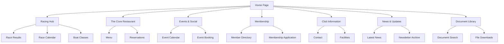

# South Caernarvonshire Yacht Club (SCYC) Website - Product Requirements Document

## 1. Product Overview

A modern, comprehensive website for South Caernarvonshire Yacht Club, rebuilding from WordPress to a modern tech stack hosted on Cloudflare Pages. The website serves as the digital hub for a prestigious sailing club founded in 1924, located in Abersoch, Wales (52°49.43'N, 04°269.89'W).

The platform addresses the needs of members, visitors, and sailing enthusiasts by providing racing information, event management, restaurant services, and club communications. It replaces an outdated WordPress site with modern functionality while preserving the club's rich heritage and extensive content library.

## 2. Core Features

### 2.1 User Roles

| Role | Registration Method | Core Permissions |
|------|---------------------|------------------|
| Visitor | No registration required | Browse public content, view racing results, restaurant menu, contact information |
| Member | Email registration with membership verification | Access member directory, private events, document downloads, race entry forms |
| Race Officer | Admin invitation | Manage race results, boat registrations, racing calendar |
| Club Admin | Super admin assignment | Full content management, user management, system configuration |

### 2.2 Feature Module

Our SCYC website consists of the following main pages:

1. **Home Page**: Hero section with club imagery, latest news carousel, quick access to racing results and events
2. **Racing Hub**: Comprehensive racing information including results, calendar, boat classes, and entry forms
3. **The Cove Restaurant**: Menu management, booking system, opening hours, and special events
4. **Events & Social**: Event calendar, social activities, private functions, and booking management
5. **Membership**: Member directory, application forms, benefits, and member resources
6. **Club Information**: History, facilities, location, contact details, and visitor information
7. **News & Updates**: Blog system with Commodore updates, club announcements, and newsletters
8. **Document Library**: Sailing programs, rules, handbooks, and official club documents

### 2.3 Page Details

| Page Name | Module Name | Feature description |
|-----------|-------------|---------------------|
| Home Page | Hero Carousel | Display rotating images of club activities with overlay text and call-to-action buttons |
| Home Page | Latest News | Show recent blog posts and Commodore updates with excerpt and read more links |
| Home Page | Quick Links | Provide fast access to racing results, event calendar, and restaurant bookings |
| Racing Hub | Results Management | Display race results by class (Dragons, Squibs, Seabirds) with filtering and search |
| Racing Hub | Race Calendar | Show upcoming races with entry deadlines, race documents, and weather information |
| Racing Hub | Boat Classes | Manage different sailing classes with specifications, rules, and class-specific information |
| The Cove | Menu Display | Present current restaurant menu with prices, dietary information, and seasonal updates |
| The Cove | Booking System | Handle restaurant reservations with date/time selection and party size management |
| Events & Social | Event Calendar | Display club events with categories, booking options, and member-only events |
| Events & Social | Event Management | Create and manage events with descriptions, pricing, and attendance tracking |
| Membership | Member Directory | Searchable member list with contact information and sailing achievements |
| Membership | Application Forms | Online membership application with document upload and payment processing |
| Club Information | Facilities Overview | Showcase clubhouse, marina, and amenities with image galleries |
| Club Information | Contact & Location | Display contact details, interactive map, and visitor information |
| News & Updates | Blog System | Publish and manage news articles with categories, tags, and comment system |
| News & Updates | Newsletter Archive | Access to past newsletters and subscription management |
| Document Library | File Management | Organize and provide downloads for sailing programs, rules, and official documents |
| Document Library | Search & Filter | Enable document search by category, date, and relevance |

## 3. Core Process

### Visitor Flow
Visitors can browse public content, view racing results, check restaurant menus, and access general club information. They can register for membership or contact the club through various forms.

### Member Flow
Members log in to access exclusive content, view member directory, download documents, enter races, and book events. They can update their profiles and manage their sailing achievements.

### Admin Flow
Administrators manage all content, user accounts, race results, events, and system settings. They can publish news, update menus, and maintain the document library.

## 4. User Interface Design

### 4.1 Design Style

- **Primary Colors**: Navy Blue (#1e3a8a) representing maritime tradition, White (#ffffff) for clarity
- **Secondary Colors**: Gold/Brass (#d4af37) for accents and achievements, Light Blue (#3b82f6) for interactive elements
- **Button Style**: Rounded corners with subtle shadows, hover animations, and clear call-to-action styling
- **Typography**: Modern sans-serif for headings (Inter/Roboto), readable serif for body text (Georgia/Times)
- **Layout Style**: Clean card-based design with maritime-inspired navigation, responsive grid system
- **Icons**: Nautical-themed icons (anchors, sailboats, compass) with consistent line weight and style

### 4.2 Page Design Overview

| Page Name | Module Name | UI Elements |
|-----------|-------------|-------------|
| Home Page | Hero Carousel | Full-width image slider with overlay text, gradient backgrounds, smooth transitions |
| Home Page | Navigation | Horizontal menu with dropdown submenus, club logo, member login button |
| Racing Hub | Results Table | Sortable data tables with alternating row colors, search filters, export options |
| Racing Hub | Calendar View | Monthly/weekly calendar grid with color-coded race types and hover details |
| The Cove | Menu Layout | Card-based menu items with images, pricing, and dietary icons |
| Events & Social | Event Cards | Grid layout with event images, dates, descriptions, and booking buttons |
| Membership | Directory Grid | Member cards with photos, contact info, and sailing achievements |
| Document Library | File Browser | List/grid view toggle, category filters, download counters, file type icons |

### 4.3 Responsiveness

Desktop-first approach with mobile-adaptive design ensuring optimal viewing on tablets and smartphones. Touch-friendly navigation with swipe gestures for image carousels and collapsible menu systems for mobile devices.