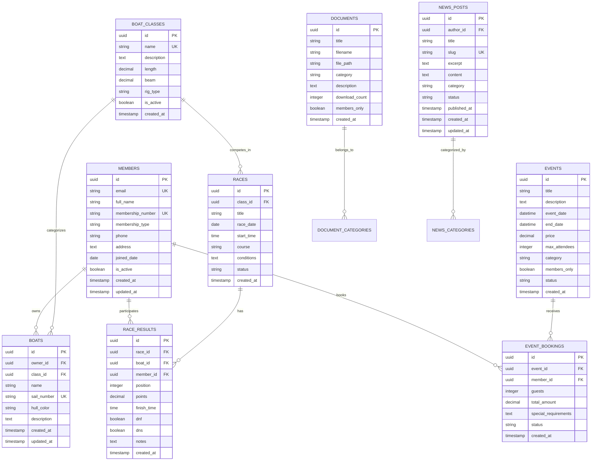

# South Caernarvonshire Yacht Club (SCYC) Website - Technical Architecture Document

## 1. Architecture Design


## 2. Technology Description

* **Frontend**: Astro\@4 + React\@18 + TypeScript + TailwindCSS\@3 + Vite

* **Backend**: Supabase (PostgreSQL + Auth + Storage + Real-time)

* **Deployment**: Cloudflare Pages with Edge Functions

* **Forms**: React Hook Form + Zod validation

* **UI Components**: Headless UI + Radix UI primitives

* **Calendar**: FullCalendar.js for event and race scheduling

* **Maps**: Leaflet.js for location and marina information

* **Search**: Fuse.js for client-side search functionality

## 3. Route Definitions

| Route                 | Purpose                                                          |
| --------------------- | ---------------------------------------------------------------- |
| /                     | Home page with hero section, latest news, and quick access links |
| /racing               | Racing hub with results, calendar, and boat class information    |
| /racing/results       | Detailed race results with filtering and search                  |
| /racing/calendar      | Race calendar with upcoming events and entry forms               |
| /racing/classes       | Boat class information and specifications                        |
| /the-cove             | Restaurant information, menu, and booking system                 |
| /events               | Social events calendar and booking management                    |
| /membership           | Member directory and application forms                           |
| /membership/directory | Searchable member directory                                      |
| /membership/apply     | Membership application form                                      |
| /club                 | Club information, history, and facilities                        |
| /club/contact         | Contact information and location details                         |
| /club/facilities      | Clubhouse and marina facilities overview                         |
| /news                 | News and blog posts with Commodore updates                       |
| /news/\[slug]         | Individual news article pages                                    |
| /documents            | Document library with search and categorization                  |
| /auth/login           | Member login page                                                |
| /auth/register        | Member registration page                                         |
| /dashboard            | Member dashboard with personal information                       |

## 4. API Definitions

### 4.1 Core API Endpoints (Supabase)

**Authentication**

```typescript
// User registration
supabase.auth.signUp({
  email: string,
  password: string,
  options: {
    data: {
      full_name: string,
      membership_type: 'full' | 'associate' | 'junior'
    }
  }
})

// User login
supabase.auth.signInWithPassword({
  email: string,
  password: string
})
```

**Race Results Management**

```typescript
// Get race results
supabase
  .from('race_results')
  .select(`
    *,
    races(*),
    boats(*),
    members(*)
  `)
  .order('race_date', { ascending: false })

// Create race result
supabase
  .from('race_results')
  .insert({
    race_id: string,
    boat_id: string,
    member_id: string,
    position: number,
    points: number,
    finish_time: string
  })
```

**Event Management**

```typescript
// Get events
supabase
  .from('events')
  .select('*')
  .gte('event_date', new Date().toISOString())
  .order('event_date', { ascending: true })

// Create event booking
supabase
  .from('event_bookings')
  .insert({
    event_id: string,
    member_id: string,
    guests: number,
    special_requirements: string
  })
```

**Document Management**

```typescript
// Upload document
supabase.storage
  .from('documents')
  .upload(`${category}/${filename}`, file)

// Get documents
supabase
  .from('documents')
  .select('*')
  .eq('category', category)
  .order('created_at', { ascending: false })
```

## 5. Data Model

### 5.1 Data Model Definition



### 5.2 Data Definition Language

**Members Table**

```sql
-- Create members table
CREATE TABLE members (
    id UUID PRIMARY KEY DEFAULT gen_random_uuid(),
    email VARCHAR(255) UNIQUE NOT NULL,
    full_name VARCHAR(255) NOT NULL,
    membership_number VARCHAR(50) UNIQUE NOT NULL,
    membership_type VARCHAR(20) DEFAULT 'associate' CHECK (membership_type IN ('full', 'associate', 'junior', 'honorary')),
    phone VARCHAR(20),
    address TEXT,
    joined_date DATE DEFAULT CURRENT_DATE,
    is_active BOOLEAN DEFAULT true,
    created_at TIMESTAMP WITH TIME ZONE DEFAULT NOW(),
    updated_at TIMESTAMP WITH TIME ZONE DEFAULT NOW()
);

-- Row Level Security
ALTER TABLE members ENABLE ROW LEVEL SECURITY;

-- Policies
CREATE POLICY "Members can view other members" ON members
    FOR SELECT USING (auth.role() = 'authenticated');

CREATE POLICY "Members can update own profile" ON members
    FOR UPDATE USING (auth.uid()::text = id::text);

-- Grants
GRANT SELECT ON members TO anon;
GRANT ALL PRIVILEGES ON members TO authenticated;
```

**Boat Classes Table**

```sql
-- Create boat_classes table
CREATE TABLE boat_classes (
    id UUID PRIMARY KEY DEFAULT gen_random_uuid(),
    name VARCHAR(100) UNIQUE NOT NULL,
    description TEXT,
    length DECIMAL(5,2),
    beam DECIMAL(5,2),
    rig_type VARCHAR(50),
    is_active BOOLEAN DEFAULT true,
    created_at TIMESTAMP WITH TIME ZONE DEFAULT NOW()
);

-- Grants
GRANT SELECT ON boat_classes TO anon;
GRANT ALL PRIVILEGES ON boat_classes TO authenticated;

-- Initial data
INSERT INTO boat_classes (name, description, length, beam, rig_type) VALUES
('Dragon', 'International Dragon Class - Classic keelboat', 8.90, 1.95, 'Sloop'),
('Squib', 'Popular one-design keelboat', 5.79, 1.83, 'Sloop'),
('Seabird', 'Traditional Welsh sailing dinghy', 4.27, 1.52, 'Sloop'),
('Laser', 'Single-handed dinghy', 4.23, 1.37, 'Sloop'),
('Optimist', 'Junior sailing dinghy', 2.30, 1.13, 'Sloop');
```

**Boats Table**

```sql
-- Create boats table
CREATE TABLE boats (
    id UUID PRIMARY KEY DEFAULT gen_random_uuid(),
    owner_id UUID REFERENCES members(id) ON DELETE CASCADE,
    class_id UUID REFERENCES boat_classes(id) ON DELETE RESTRICT,
    name VARCHAR(255) NOT NULL,
    sail_number VARCHAR(50) UNIQUE NOT NULL,
    hull_color VARCHAR(50),
    description TEXT,
    created_at TIMESTAMP WITH TIME ZONE DEFAULT NOW(),
    updated_at TIMESTAMP WITH TIME ZONE DEFAULT NOW()
);

-- Indexes
CREATE INDEX idx_boats_owner_id ON boats(owner_id);
CREATE INDEX idx_boats_class_id ON boats(class_id);
CREATE INDEX idx_boats_sail_number ON boats(sail_number);

-- Grants
GRANT SELECT ON boats TO anon;
GRANT ALL PRIVILEGES ON boats TO authenticated;
```

**Races Table**

```sql
-- Create races table
CREATE TABLE races (
    id UUID PRIMARY KEY DEFAULT gen_random_uuid(),
    class_id UUID REFERENCES boat_classes(id) ON DELETE RESTRICT,
    title VARCHAR(255) NOT NULL,
    race_date DATE NOT NULL,
    start_time TIME,
    course TEXT,
    conditions TEXT,
    status VARCHAR(20) DEFAULT 'scheduled' CHECK (status IN ('scheduled', 'in_progress', 'completed', 'cancelled')),
    created_at TIMESTAMP WITH TIME ZONE DEFAULT NOW()
);

-- Indexes
CREATE INDEX idx_races_date ON races(race_date DESC);
CREATE INDEX idx_races_class_id ON races(class_id);
CREATE INDEX idx_races_status ON races(status);

-- Grants
GRANT SELECT ON races TO anon;
GRANT ALL PRIVILEGES ON races TO authenticated;
```

**Race Results Table**

```sql
-- Create race_results table
CREATE TABLE race_results (
    id UUID PRIMARY KEY DEFAULT gen_random_uuid(),
    race_id UUID REFERENCES races(id) ON DELETE CASCADE,
    boat_id UUID REFERENCES boats(id) ON DELETE CASCADE,
    member_id UUID REFERENCES members(id) ON DELETE CASCADE,
    position INTEGER,
    points DECIMAL(5,2),
    finish_time TIME,
    dnf BOOLEAN DEFAULT false,
    dns BOOLEAN DEFAULT false,
    notes TEXT,
    created_at TIMESTAMP WITH TIME ZONE DEFAULT NOW()
);

-- Indexes
CREATE INDEX idx_race_results_race_id ON race_results(race_id);
CREATE INDEX idx_race_results_member_id ON race_results(member_id);
CREATE INDEX idx_race_results_position ON race_results(position);

-- Grants
GRANT SELECT ON race_results TO anon;
GRANT ALL PRIVILEGES ON race_results TO authenticated;
```

**Events Table**

```sql
-- Create events table
CREATE TABLE events (
    id UUID PRIMARY KEY DEFAULT gen_random_uuid(),
    title VARCHAR(255) NOT NULL,
    description TEXT,
    event_date TIMESTAMP WITH TIME ZONE NOT NULL,
    end_date TIMESTAMP WITH TIME ZONE,
    price DECIMAL(8,2) DEFAULT 0,
    max_attendees INTEGER,
    category VARCHAR(50) DEFAULT 'social',
    members_only BOOLEAN DEFAULT false,
    status VARCHAR(20) DEFAULT 'active' CHECK (status IN ('active', 'cancelled', 'completed')),
    created_at TIMESTAMP WITH TIME ZONE DEFAULT NOW()
);

-- Indexes
CREATE INDEX idx_events_date ON events(event_date);
CREATE INDEX idx_events_category ON events(category);

-- Grants
GRANT SELECT ON events TO anon;
GRANT ALL PRIVILEGES ON events TO authenticated;
```

**Documents Table**

```sql
-- Create documents table
CREATE TABLE documents (
    id UUID PRIMARY KEY DEFAULT gen_random_uuid(),
    title VARCHAR(255) NOT NULL,
    filename VARCHAR(255) NOT NULL,
    file_path TEXT NOT NULL,
    category VARCHAR(100) NOT NULL,
    description TEXT,
    download_count INTEGER DEFAULT 0,
    members_only BOOLEAN DEFAULT false,
    created_at TIMESTAMP WITH TIME ZONE DEFAULT NOW()
);

-- Indexes
CREATE INDEX idx_documents_category ON documents(category);
CREATE INDEX idx_documents_created_at ON documents(created_at DESC);

-- Grants
GRANT SELECT ON documents TO anon;
GRANT ALL PRIVILEGES ON documents TO authenticated;
```

